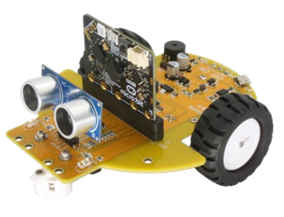

# PyoBot

micro:bit robot board extension for MakeCode (표쌤코딩)

## Usage

This extension adds **PyoBot** blocks to MakeCode for controlling the PyoBot robot car.

### Add to MakeCode

- Open MakeCode editor: https://makecode.microbit.org
- Click **Extensions**
- Search for **pyobot** or paste: `https://github.com/pyocodingcompany-crypto/pyobot-makecode`

### Blocks

#### Motor
- `왼쪽/오른쪽/양쪽 모터 전진/후진 속도 0~1023`
- `왼쪽/오른쪽/양쪽 모터 정지`
- `좌회전/우회전 속도 0~1023`

#### Line Sensor
- `왼쪽/오른쪽 라인센서 감지` (0: white, 1: black)
- `왼쪽/오른쪽 라인센서 검정 감지?` (boolean)

#### Ultrasonic
- `초음파 거리 cm`

#### LED
- `왼쪽/오른쪽/양쪽 LED 켜기/끄기`

#### Buzzer
- `부저 주파수 Hz ms`
- `부저 끄기`

#### Servo
- `서보 각도 0~180°`
- `서보 해제`

### Pin Map

| Function | Pin |
|----------|-----|
| LED Left | P3 |
| LED Right | P4 |
| Buzzer | P0 |
| Line Sensor Left | P6 |
| Line Sensor Right | P7 |
| Ultrasonic Trig | P1 |
| Ultrasonic Echo | P10 |
| Motor Left PWM | P8 |
| Motor Left Dir | P9, P13 |
| Motor Right PWM | P16 |
| Motor Right Dir | P14, P15 |
| Servo | P2 |
| I2C SCL | P19 |
| I2C SDA | P20 |

### HuskyLens (AI 카메라) 연동

PyoBot과 HuskyLens를 함께 사용할 수 있습니다. (I2C: P19/P20)

1. 확장에서 추가: `https://github.com/DFRobot/pxt-DFRobot_HuskyLens`
2. PyoBot 확장과 동시에 사용 가능 (핀 충돌 없음)

HuskyLens AI 기능: 얼굴 인식, 객체 추적, 라인 추적, 색상 인식, 태그/QR코드 인식

## License

MIT

#### Metadata (used for search, rendering)

* for PXT/microbit

