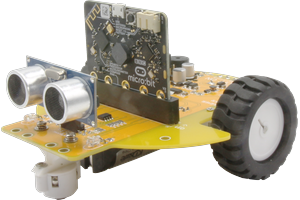

# PyoBot



PyoBot is a micro:bit robot car board extension for Microsoft MakeCode.

## Add to MakeCode

1. Open https://makecode.microbit.org
2. Create or open a project
3. Open **Extensions**
4. Search for `pyobot` or paste:
   `https://github.com/pyocodingcompany-crypto/pyobot-makecode`

## API Reference

### Motors

```blocks
// Run both motors forward at speed 500
PyoBot.motorRun(PyoMotor.Both, PyoDirection.Forward, 500)

// Run left motor backward at speed 300
PyoBot.motorRun(PyoMotor.Left, PyoDirection.Backward, 300)

// Stop all motors
PyoBot.motorStop(PyoMotor.Both)

// Turn left at speed 500
PyoBot.motorTurn(PyoTurn.Left, 500)

// Turn right at speed 500
PyoBot.motorTurn(PyoTurn.Right, 500)
```

### Line Sensor

```blocks
// Read raw line sensor value (0: white, 1: black)
let val = PyoBot.lineSensor(PyoLineSensor.Left)

// Check if black line is detected
if (PyoBot.lineDetected(PyoLineSensor.Left)) {}

// Check if black line is not detected
if (PyoBot.lineNotDetected(PyoLineSensor.Right)) {}
```

### Ultrasonic

```blocks
// Measure distance in cm
let dist = PyoBot.ultrasonic()
basic.showNumber(dist)
```

### LED

```blocks
// Turn on both LEDs
PyoBot.pyoLed(PyoLED.Both, PyoLEDState.On)

// Turn off left LED
PyoBot.pyoLed(PyoLED.Left, PyoLEDState.Off)
```

### Buzzer

```blocks
// Play tone at 262Hz for 500ms
PyoBot.buzzer(262, 500)

// Stop buzzer
PyoBot.buzzerOff()
```

### Servo

```blocks
// Set servo to 90 degrees
PyoBot.servo(90)

// Release servo
PyoBot.servoRelease()
```

## Pin Map

| Function | Pin |
| --- | --- |
| LED Left / Right | P3 / P4 |
| Buzzer | P0 |
| Line Sensor Left / Right | P6 / P7 |
| Ultrasonic Trig / Echo | P1 / P10 |
| Motor Left (PWM, Dir) | P8, P9, P13 |
| Motor Right (PWM, Dir) | P16, P14, P15 |
| Servo | P2 |
| I2C (SCL / SDA) | P19 / P20 |

## HuskyLens

PyoBot can be used together with HuskyLens over I2C on `P19` and `P20`.

- HuskyLens extension: `https://github.com/DFRobot/pxt-DFRobot_HuskyLens`
- No pin conflict with PyoBot

## License

MIT

#### Metadata

* for PXT/microbit
<script src="https://makecode.com/gh-pages-embed.js"></script>
<script>makeCodeRender("{{ site.makecode.home_url }}", "{{ site.github.owner_name }}/{{ site.github.repository_name }}")</script>
